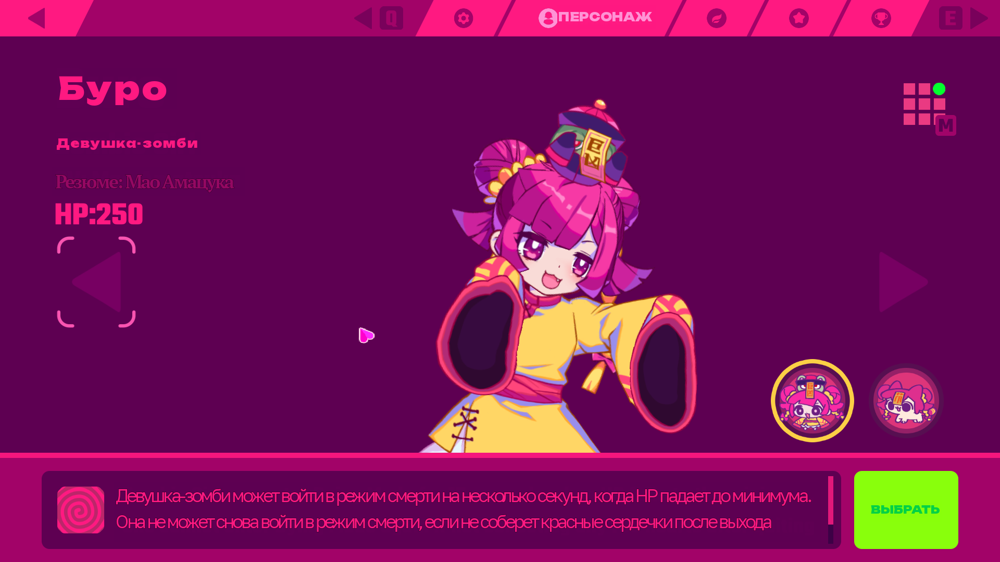
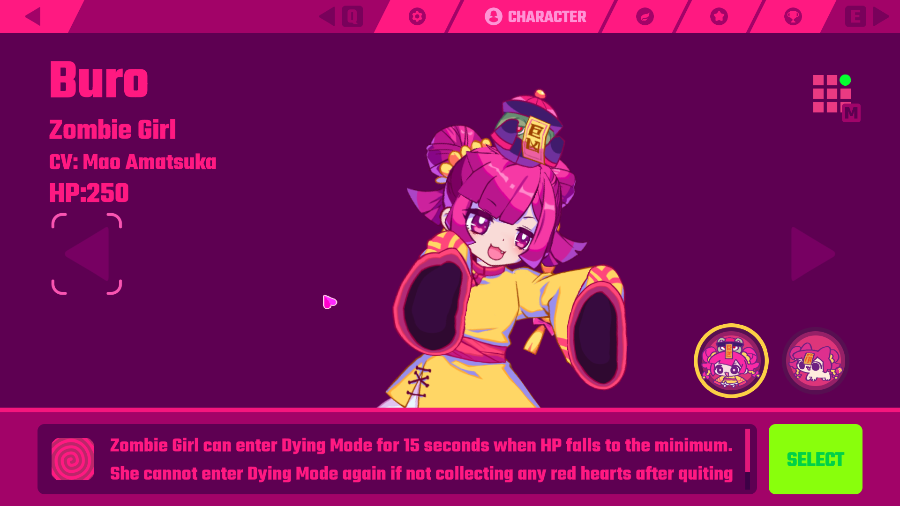
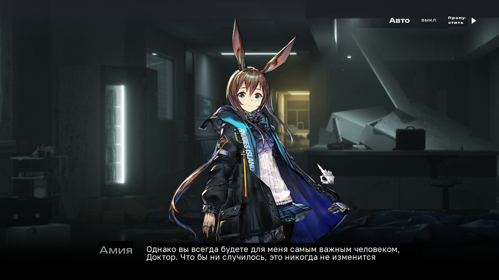
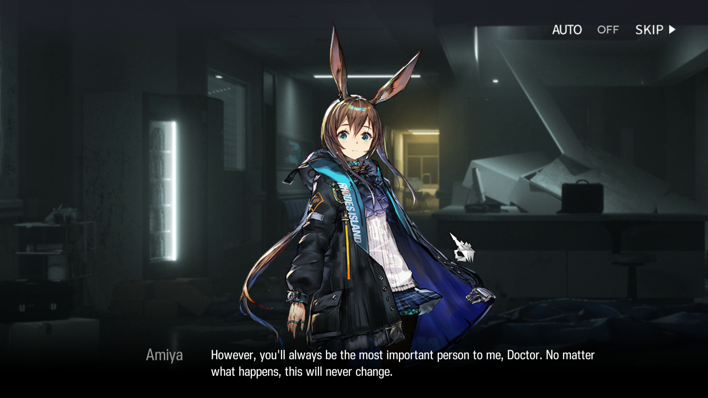

<div align="center">

<a href="README.en.md"></a>
<a href="README.md"></a>

<br>

<h3>Kizurium Translator</h3>

<br>

<a href="#-screenshots-"><kbd>&nbsp;&nbsp;<br>SCREENSHOTS<br>&nbsp;&nbsp;</kbd></a>&ensp;&ensp;
<a href="#-installation-"><kbd>&nbsp;&nbsp;<br>INSTALL<br>&nbsp;&nbsp;</kbd></a>&ensp;&ensp;
<a href="docs/trust.md"><kbd>&nbsp;&nbsp;<br>PRIVACY<br>&nbsp;&nbsp;</kbd></a>&ensp;&ensp;
<a href="#-documentation-"><kbd>&nbsp;&nbsp;<br>DOCS<br>&nbsp;&nbsp;</kbd></a>&ensp;&ensp;
<a href="https://github.com/Kizuchann/kizurium-translator/issues"><kbd>&nbsp;&nbsp;<br>ISSUES<br>&nbsp;&nbsp;</kbd></a>

<br><br>


</div>

## • overview •

A Wayland-native screen translator and OCR tool for Linux, featuring live
translation overlays and flexible text processing.

Kizurium can capture a selected area of the screen, recognize text with OCR,
translate it between languages, and display the result directly over the original
content. The window is not intercepted: the overlay lives on its own layer.

It supports three main workflows:

- **OCR** — recognize text from a selected screen region.
- **Translation** — translate text between a configurable source and target
  language.
- **Live Translation** — continuously recognize and translate changing text and
  render the translation as a Wayland overlay.

Kizurium is designed for Wayland desktops and currently supports Arch-based
distributions and Nix/NixOS, with additional manual installation paths available.

## • installation •

**Arch** — `pacman` installs it and can remove it:

```bash
git clone https://github.com/Kizuchann/kizurium-translator.git
cd kizurium-translator
makepkg -si
```

`makepkg -si` installs tesseract. RapidOCR is not in the Arch repositories, only
on PyPI (27 MB plus 21 MB of onnxruntime), so the package does not pull it:
pacman cannot install from pip, and baking the wheels
into the build would cost it its reproducibility. For RapidOCR use `./install.sh`, which installs it.

**Any distribution** — the installer puts the command in `~/.local/bin`:

```bash
git clone https://github.com/Kizuchann/kizurium-translator.git
cd kizurium-translator
./install.sh
```

**NixOS / Nix** — flakes ship with the repository:

```bash
nix profile add github:Kizuchann/kizurium-translator
# or in configuration.nix
#   inputs.kizurium.url = "github:Kizuchann/kizurium-translator";
```

<details>
<summary>Dependencies</summary>

```bash
Pillow  numpy  pytesseract  requests          # pip
python-gobject  python-cairo  gtk4  gtk4-layer-shell   # distribution
tesseract{,-data-eng,-data-jpn,-data-rus}  grim  slurp  quickshell
wl-clipboard  aria2  libnotify
```

</details>

To run it: pick a region with the mouse and get the translation on top of the
text.

```bash
kizurium-translator --toggle
```

## • screenshots •

<div align="center">

| translated | original |
|:--:|:--:|
|  |  |

</div>

<div align="center">

| translated | original |
|:--:|:--:|
|  |  |

</div>

## • installation •

```bash
./install.sh
kizurium-translator --toggle
```

Full instructions — [`docs/install.md`](docs/install.md).

<details>
<summary>Dependencies</summary>

```bash
Pillow  numpy  pytesseract  requests          # pip
python-gobject  python-cairo  gtk4  gtk4-layer-shell   # distribution
tesseract{,-data-eng,-data-jpn,-data-rus}  grim  slurp  quickshell
wl-clipboard  aria2  libnotify
```

</details>

<details>
<summary>Commands</summary>

| | |
|---|---|
| `--toggle` | pick a region with the mouse and start |
| `--live -g 0,0 1920x1080` | live translation of a region |
| `--ocr-copy` | region → text on the clipboard |
| `--text` | the text translator window |
| `--stop` | stop |
| `--status` | session state |
| `--doctor` | check the environment |
| `--profile ID` | a game profile (opt-in) |
| `--offline-only` | refuse network backends |
| `--pack-install ID` | install an offline pack |

</details>

## • privacy •

More — [`docs/trust.md`](docs/trust.md).

Screen captures never leave the machine. Only the text being translated goes
out, and only when a network backend is chosen. The app holds no API keys and
has no telemetry.

## • dictionaries •

A dictionary of your own matters more than the model.

```bash
kizurium-translator --import-dictionary ~/my-dict.tsv
```

Priority: yours → profile → game pack → shared. Game vocabulary lives in
opt-in packs, enabled through `--profile`. Without a profile it is universal
mode.

## • documentation •

| | |
|---|---|
| [`docs/install.md`](docs/install.md) | installation, hotkeys |
| [`docs/trust.md`](docs/trust.md) | what leaves the machine |
| [`docs/layout-families.md`](docs/layout-families.md) | telling a line of dialogue from a button |
| [`docs/external-dictionaries.md`](docs/external-dictionaries.md) | dictionary formats |
| [`docs/language-packs.md`](docs/language-packs.md) | offline packs |
| [`docs/licenses.md`](docs/licenses.md) | licences |

```bash
uv run pytest -q          # 1935 tests
uv run ruff check src/
```

## • known limitations •

- Who is speaking comes from the shape `Name: line`. No name in frame, no answer.
- Boss glyphs can be marked "not text" by a profile. Automatically — no.
- Slant and weight are measured off the ink; below 34px of ink the slant is not
  measured.

---

<div align="center">

**AGPL-3.0-or-later** · [LICENSE](LICENSE) · [NOTICE](NOTICE)

<sub>Screenshots are from games belonging to their rights holders, shown as a demonstration.</sub>

</div>